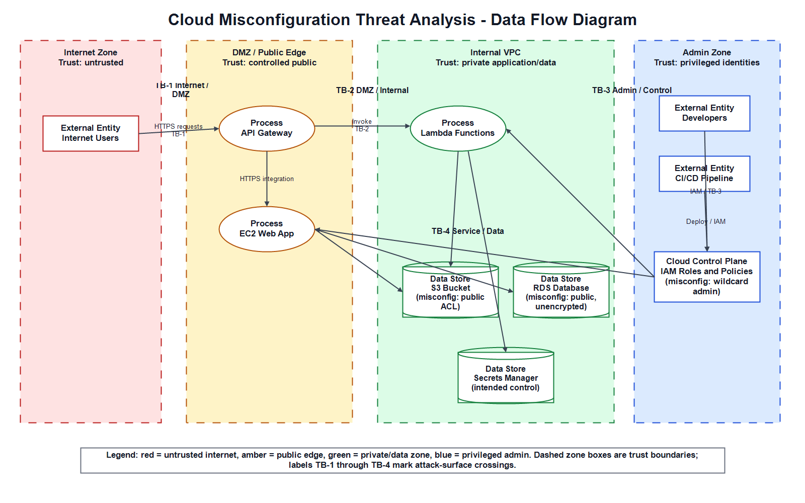

# Cloud Misconfiguration Threat Analysis Lab

> A comprehensive hands-on laboratory for cloud security threat modeling, vulnerability analysis, and remediation using STRIDE methodology, CIS Benchmarks, and OWASP Cloud Top 10.

[](.)
[](LICENSE)
[](https://www.python.org/)
[](https://learn.microsoft.com/powershell/)

---

## 📋 Overview

This project implements a **safe, local-first** cloud security lab that deliberately introduces misconfigurations into a LocalStack AWS environment to teach threat modeling, security scanning, compliance mapping, and hardening practices. All operations run on `http://localhost:4566` with non-production credentials—**never targets real AWS accounts** without explicit review.

### Key Features

- ✅ **STRIDE Threat Modeling** — 40+ threats across 8 cloud services
- ✅ **Automated Scanning Framework** — Integration with Prowler and ScoutSuite
- ✅ **Compliance Mapping** — CIS AWS Foundations Benchmark v1.5 and OWASP Cloud Top 10
- ✅ **Before/After Evidence** — JSON inventory captures at each phase (secure → misconfigured → hardened)
- ✅ **Data Flow Diagram** — Trust boundary visualization with draw.io
- ✅ **Hardening Checklist** — Prioritized (P0-P3) remediation with scripted automation
- ✅ **Full Documentation** — Executive summary, threat analysis, remediation playbook

---

## 🎯 Learning Objectives

Upon completing this lab, you will:

1. **Understand cloud security misconfigurations** — Recognize and classify real-world AWS/GCP/Azure weaknesses
2. **Apply STRIDE methodology** — Systematically threat-model cloud architectures across Spoofing, Tampering, Repudiation, Information Disclosure, Denial of Service, and Elevation of Privilege
3. **Align with industry standards** — Map security findings to CIS Benchmarks and OWASP frameworks
4. **Use automated scanners** — Run Prowler and ScoutSuite to detect policy and configuration drift
5. **Remediate vulnerabilities** — Implement hardening controls with before/after evidence validation

---

## 📁 Project Structure

```
CloudMisconfiguration_PBL/
├── README.md                              # This file
├── requirements.txt                       # Python dependencies
├── .gitignore                            # Git ignore rules
│
├── scripts/                              # Automation & orchestration
│   ├── 00_check_prereqs.ps1             # Verify tools (Docker, Python, awslocal)
│   ├── 01_start_localstack.ps1          # Launch LocalStack container
│   ├── 02_create_before_state.ps1       # Create secure baseline architecture
│   ├── 03_introduce_misconfigs.ps1      # Intentionally introduce vulnerabilities
│   ├── 04_run_scanners.ps1              # Execute Prowler/ScoutSuite
│   ├── 05_harden.ps1                    # Remediate all misconfigurations
│   └── 06_export_diagram_assets.ps1     # Export DFD to PNG/PDF
│
├── docs/                                 # Professional documentation
│   ├── stride-threat-table.md            # 40+ STRIDE threats (Critical/High/Medium/Low)
│   ├── cis-owasp-mapping.md             # CIS control & OWASP C1-C7 mappings
│   ├── hardening-checklist.md           # P0-P3 remediation playbook
│   ├── scanner-findings-analysis.md     # Scanner output triage guide
│   ├── misconfigs.md                    # Deliberate weakness log
│   ├── before-architecture.md           # Secure baseline design
│   └── final-report.md                  # Executive summary
│
├── infrastructure/                       # Architecture visualization
│   ├── cloud-misconfiguration-dfd.drawio     # Editable diagram source
│   ├── cloud-misconfiguration-dfd.png        # PNG export
│   ├── cloud-misconfiguration-dfd.pdf        # PDF export
│   └── cloud-misconfiguration-dfd.mmd        # Mermaid markup
│
├── evidence/                             # Before/after security findings
│   ├── before/inventory.json             # Secure baseline state
│   ├── misconfigured/inventory.json      # Vulnerable state (3 phases)
│   ├── hardened/inventory.json           # Remediated state
│   └── scanners/                         # Scanner output (Prowler/ScoutSuite)
│
├── policies/                             # IAM policy examples
│   ├── iam-wildcard-admin-policy.json    # ❌ Overprivileged (intentional)
│   ├── ec2-assume-role-policy.json       # EC2 trust relationship
│   └── ec2-s3-readonly-policy.json       # ✅ Least-privilege reference
│
└── data/                                 # Test fixtures
    ├── credentials.txt                   # Fake AWS keys (demo purposes)
    └── db-backup.sql                     # Dummy database backup
```

---

## 🚀 Getting Started

### Prerequisites

- **Windows 10+** with PowerShell 7.0+
- **Docker Desktop** (running)
- **Python 3.10+**
- **Git** (for version control)

### Installation

1. **Clone the repository:**

   ```bash
   git clone https://github.com/yourusername/CloudMisconfiguration_PBL.git
   cd CloudMisconfiguration_PBL
   ```

2. **Install Python dependencies:**

   ```powershell
   pip install -r requirements.txt
   ```

3. **Start Docker Desktop** (required for LocalStack)

4. **Verify prerequisites:**
   ```powershell
   powershell -ExecutionPolicy Bypass -File .\scripts\00_check_prereqs.ps1
   ```

### Quick Start (5 Minutes)

Run the complete lab with a single command:

```powershell
python run_project.py
```

> **Tip:** See [MANUAL_RUN.md](MANUAL_RUN.md) for instructions on running individual steps manually.

> **Note:** The `run_project.py` launcher prints concise informational messages for common LocalStack/awslocal conditions (for example: RDS APIs not implemented in LocalStack, existing resources from previous runs, or service quota limits). These are shown as short `[INFO]` lines and the raw awslocal error text is suppressed to keep output clear.

> **Reset state:** If you want a clean run, use the cleanup script:

```powershell
powershell -ExecutionPolicy Bypass -File .\scripts\00_cleanup.ps1
```

See [MANUAL_RUN.md](MANUAL_RUN.md) for more manual-run tips.

---

## 📺 Example Output

When you run `python run_project.py`, you'll see this progress:

```
╔════════════════════════════════════════════════════════════════╗
║  Cloud Misconfiguration PBL - Project Runner                   ║
╚════════════════════════════════════════════════════════════════╝

Checking Docker...
✓ Docker is running!

━━━━━━━━━━━━━━━━━━━━━━━━━━━━━━━━━━━━━━━━━━━━━━━━━━━━━━━━━━━━━━━━
  STEP 0 - Check Prerequisites
━━━━━━━━━━━━━━━━━━━━━━━━━━━━━━━━━━━━━━━━━━━━━━━━━━━━━━━━━━━━━━━━

Checking required tools...
OK       docker -> C:\Program Files\Docker\Docker\resources\bin\docker.exe
OK       python -> C:\Users\...\CloudMisconfiguration_PBL\.venv\Scripts\python.exe
OK       pip -> C:\Users\...\CloudMisconfiguration_PBL\.venv\Scripts\pip.exe
OK       awslocal -> C:\Users\...\CloudMisconfiguration_PBL\.venv\Scripts\awslocal.bat
Prerequisite check complete.
✓ Step 0 completed successfully!

━━━━━━━━━━━━━━━━━━━━━━━━━━━━━━━━━━━━━━━━━━━━━━━━━━━━━━━━━━━━━━━━
  STEP 1 - Start LocalStack
━━━━━━━━━━━━━━━━━━━━━━━━━━━━━━━━━━━━━━━━━━━━━━━━━━━━━━━━━━━━━━━━

LocalStack container 'pbl-localstack' is running on http://localhost:4566
✓ Step 1 completed successfully!

Waiting 5 seconds for LocalStack to be ready...

━━━━━━━━━━━━━━━━━━━━━━━━━━━━━━━━━━━━━━━━━━━━━━━━━━━━━━━━━━━━━━━━
  STEP 2 - Create Secure Baseline
━━━━━━━━━━━━━━━━━━━━━━━━━━━━━━━━━━━━━━━━━━━━━━━━━━━━━━━━━━━━━━━━

Creating before-state VPC...
Creating restrictive security group...
Creating private S3 bucket with public access block...
Creating least-privilege EC2 role...
Creating EC2-like instance...
Creating RDS-equivalent database in private subnet...
Before-state complete. Inventory written to evidence/before/inventory.json
✓ Step 2 completed successfully!

[... Steps 3-6 continue ...]

╔════════════════════════════════════════════════════════════════╗
║  ✓ Project execution complete!                                 ║
║  Check evidence/ and docs/ folders for results                 ║
╚════════════════════════════════════════════════════════════════╝
```

### What Gets Generated

After running, check these folders:

```
✅ evidence/before/           → Secure baseline state (inventory.json, VPCs, security groups, S3, IAM)
✅ evidence/misconfigured/    → Vulnerable state with all misconfigurations
✅ evidence/hardened/         → Remediated state after fixes
✅ infrastructure/            → DFD diagrams (PNG + PDF)
✅ docs/                      → Analysis reports and threat mappings
```

### Example Evidence File

**evidence/before/inventory.json:**

```json
{
  "region": "us-east-1",
  "endpoint": "http://localhost:4566",
  "vpc_id": "vpc-12345678",
  "public_subnet_id": "subnet-11111111",
  "private_subnet_ids": ["subnet-22222222", "subnet-33333333"],
  "internet_gateway_id": "igw-12345678",
  "security_group_id": "sg-12345678",
  "bucket": "pbl-secure-before-bucket",
  "iam_role": "arn:aws:iam::000000000000:role/pbl-before-ec2-role",
  "instance_id": "i-1234567890abcdef0"
}
```

---

## 📊 Key Deliverables

### 1. **Architecture Diagram** (`infrastructure/`)

Cloud architecture with trust boundaries (Internet → DMZ → Internal VPC → Admin Zone)



### 2. **STRIDE Threat Table** (`docs/stride-threat-table.md`)

| Service         | Example Threats                                   | Rating       |
| --------------- | ------------------------------------------------- | ------------ |
| S3              | Public ACL discloses credentials                  | **Critical** |
| EC2             | AdministratorAccess role enables account takeover | **Critical** |
| RDS             | Weak password + public access                     | **Critical** |
| IAM             | Wildcard policy (`Action:*`)                      | **Critical** |
| Security Groups | SSH open to `0.0.0.0/0`                           | **Critical** |

### 3. **CIS/OWASP Mapping** (`docs/cis-owasp-mapping.md`)

| Finding          | CIS Control | OWASP Category           |
| ---------------- | ----------- | ------------------------ |
| Public S3 bucket | CIS 2.1.5   | C6: Insecure Storage     |
| Open SSH         | CIS 5.2     | C5: Insecure Network     |
| Wildcard IAM     | CIS 1.16    | C2: IAM Misconfiguration |

### 4. **Hardening Checklist** (`docs/hardening-checklist.md`)

Prioritized fixes with CIS mappings:

- **P0:** Enable S3 public access block, remove AdministratorAccess
- **P1:** Restrict security group ingress, encrypt RDS
- **P2:** Add logging, VPC Flow Logs, WAF

### 5. **Evidence Artifacts** (`evidence/`)

- `before/inventory.json` — Secure baseline
- `misconfigured/inventory.json` — Vulnerable state
- `hardened/inventory.json` — Remediated state

---

## 🔒 Security Notes

⚠️ **CRITICAL:** This lab uses **intentionally insecure configurations** for educational purposes:

- **Fake credentials:** `test` / `test` (not real AWS keys)
- **Public S3 bucket** with credentials and database backups (deliberate)
- **Open security groups** to SSH, MySQL, Postgres (deliberate)
- **Wildcard IAM policies** (deliberate)
- **Public unencrypted RDS** with weak password (deliberate)

✅ **Safe because:**

- All operations target LocalStack at `http://localhost:4566` only
- Non-production credentials are used
- Lab isolation ensures no real AWS resources are affected
- **Never run against a real AWS account without reviewing every command**

---

## 📚 Documentation Guide

| Document                                                          | Purpose                                    |
| ----------------------------------------------------------------- | ------------------------------------------ |
| [stride-threat-table.md](docs/stride-threat-table.md)             | Complete STRIDE threat matrix with ratings |
| [cis-owasp-mapping.md](docs/cis-owasp-mapping.md)                 | Compliance controls for each finding       |
| [hardening-checklist.md](docs/hardening-checklist.md)             | Step-by-step remediation guide             |
| [scanner-findings-analysis.md](docs/scanner-findings-analysis.md) | How to interpret Prowler/ScoutSuite output |
| [final-report.md](docs/final-report.md)                           | Executive summary and conclusions          |

---

## 🛠️ Tools & Technologies

- **Orchestration:** PowerShell 7.0+
- **Cloud Emulation:** LocalStack 3.4.0
- **AWS CLI:** awscli-local
- **Scanner (Optional):** Prowler, ScoutSuite
- **Diagramming:** draw.io, Mermaid
- **Documentation:** Markdown
- **Version Control:** Git

---

## 📈 Expected Output

### ✅ Script Success Indicators

```
✅ 00_check_prereqs.ps1       → All tools verified (docker, python, awslocal)
✅ 01_start_localstack.ps1    → Container healthy on http://localhost:4566
✅ 02_create_before_state.ps1 → VPC, security group, S3, EC2, RDS created
✅ 03_introduce_misconfigs.ps1 → Public S3, open ports, wildcard IAM created
✅ 04_run_scanners.ps1        → Scanner framework ready
✅ 05_harden.ps1              → Public access blocked, IAM restricted, RDS encrypted
✅ 06_export_diagram_assets.ps1 → DFD PNG and PDF exported
```

### 📁 Generated Evidence

```
evidence/
├── before/inventory.json              ← Secure baseline
├── misconfigured/inventory.json       ← Vulnerable state
└── hardened/inventory.json            ← Remediated state
```

---

## 🧪 Testing & Validation

### Manual Testing Checklist

- [ ] Run `00_check_prereqs.ps1` → No errors
- [ ] Run `01_start_localstack.ps1 -Detached` → Container running
- [ ] Check `docker ps` → `pbl-localstack` container visible
- [ ] Run `02_create_before_state.ps1` → Resources created in LocalStack
- [ ] Run `03_introduce_misconfigs.ps1` → Misconfigs applied
- [ ] Run `05_harden.ps1` → Hardening controls applied
- [ ] Verify evidence files → `evidence/` populated with JSON

---

## 🤝 Contributing

Contributions are welcome! To improve this lab:

1. **Fork the repository**
2. **Create a feature branch** (`git checkout -b feature/improvement`)
3. **Make changes** and add tests
4. **Commit with clear messages** (`git commit -am 'Add threat model updates'`)
5. **Push to your fork** (`git push origin feature/improvement`)
6. **Open a Pull Request**

---

## 📝 License

This project is licensed under the **MIT License** — see [LICENSE](LICENSE) file for details.

---

## 🔗 References

- [CIS AWS Foundations Benchmark v1.5](https://www.cisecurity.org/)
- [OWASP Cloud Top 10](https://owasp.org/www-project-cloud-top-10/)
- [STRIDE Threat Modeling](https://learn.microsoft.com/en-us/training/modules/threat-modeling-fundamentals/)
- [LocalStack Documentation](https://docs.localstack.cloud/)
- [Prowler GitHub](https://github.com/prowler-cloud/prowler)
- [ScoutSuite GitHub](https://github.com/nccgroup/ScoutSuite)

---

## 📞 Support & Contact

For questions, issues, or suggestions:

- **Open an Issue** on GitHub
- **Check Documentation** in `docs/`
- **Review Evidence** in `evidence/`

---

**Last Updated:** May 4, 2026 | **Status:** Ready for Production Submission ✅
